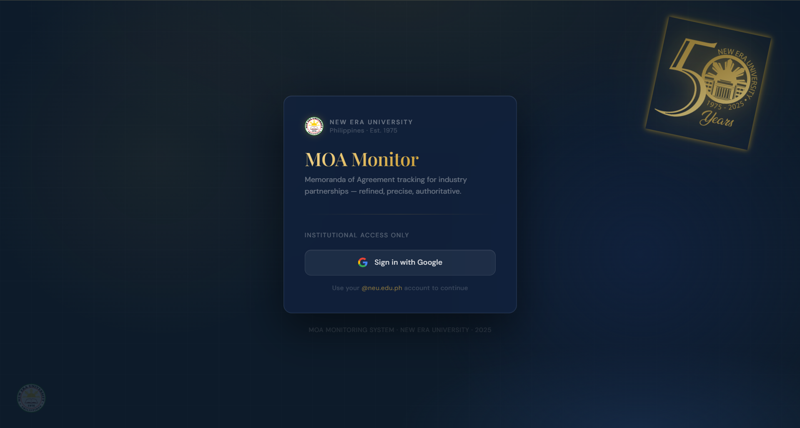

<div align="center">


# NEU MOA Monitoring System

**A full-stack web application for tracking and managing Memoranda of Agreement at New Era University**

[](https://react.dev)
[](https://vitejs.dev)
[](https://firebase.google.com)
[](https://firebase.google.com/docs/firestore)
[](https://pe-moa-monitor.web.app)

### 🌐 [View Live Demo → pe-moa-monitor.web.app](https://pe-moa-monitor.web.app)

</div>

---

## 📖 About the Project

This is my Professional Elective 2 personal project — a role-based MOA management platform built for New Era University's OJT coordination office.

MOAs (Memoranda of Agreement) are formal partnership agreements between NEU and external companies that open up internship and training opportunities for students. Before this system, those records lived in spreadsheets — no visibility on expiring agreements, no audit trail, no way for students to browse available partners. This application fixes all of that.

There is a full admin and faculty side for managing the complete MOA lifecycle (from initial processing through signing, active use, expiry, and renewal), and a student-facing view where OJT students can browse approved partner companies filtered by industry.

---

## 🛠️ Tech Stack

| Layer | Technology | Why I used it |
|---|---|---|
| Framework | React 18 + Vite 5 | Fast dev server, component-based UI |
| Routing | React Router DOM v6 | Protected routes with role-based guards |
| Auth | Firebase Authentication | Email/password with NEU domain enforcement |
| Database | Cloud Firestore | Real-time NoSQL with sub-collections for audit trail |
| Hosting | Firebase Hosting | Free, fast, deploys in one command |
| Charts | Recharts 2 | Composable chart components for statistics dashboard |
| Styling | Inline CSS (dark design system) | Consistent dark UI, zero CSS framework overhead |

---

## ✨ Features

### 🛡️ Admin
- Full CRUD on all MOA records across all colleges
- Add, edit, and soft-delete MOA entries (records are never permanently lost)
- Update MOA status through the complete 8-stage lifecycle
- Renew expiring/expired MOAs — creates a new record and auto-archives the old one
- View an immutable, per-MOA audit trail (every change logged with before/after snapshots)
- View a chronological status timeline derived from the audit trail
- Add internal notes to any MOA record
- Manage all user accounts (create, deactivate, reassign roles)
- View statistics dashboard with charts broken down by status, college, and industry
- Seed and reset the database (demo mode)

### 👩‍🏫 Faculty
- View all MOA records with advanced filtering (status, college, industry, keyword search)
- Add new MOA records and edit existing ones
- Update MOA statuses and trigger the renewal workflow
- View audit trail and add internal notes per MOA
- Access the statistics dashboard and student directory

### 🎓 Student
- Browse all **approved** MOA partner companies
- Filter by industry with live result counts
- View full partnership details in a dedicated modal — description, contact info, available slots, and agreement logistics
- See a 2-line partnership description preview on each card

---

## 📸 Screenshots

> Screenshots will be added here. See the [/docs/screenshots/](docs/screenshots/) folder.

<table>
  <tr>
    <td align="center" width="50%">
      
      <br /><sub><b>Login Page</b> — Institutional email sign-in with NEU branding</sub>
    </td>
    <td align="center" width="50%">
      
      <br /><sub><b>Admin Dashboard</b> — MOA stats and status breakdown at a glance</sub>
    </td>
  </tr>
  <tr>
    <td align="center" width="50%">
      
      <br /><sub><b>MOA Registry</b> — Filterable table with status badges and slide-in detail panel</sub>
    </td>
    <td align="center" width="50%">
      
      <br /><sub><b>MOA Detail Panel</b> — Full info, status timeline, audit trail, and notes</sub>
    </td>
  </tr>
  <tr>
    <td align="center" width="50%">
      
      <br /><sub><b>Student Dashboard</b> — Industry-filtered card grid of approved partners</sub>
    </td>
    <td align="center" width="50%">
      
      <br /><sub><b>Statistics</b> — Recharts breakdown by status, college, and industry</sub>
    </td>
  </tr>
</table>

---

## 🗄️ Firestore Data Model

### `users` collection
One document per registered user — document ID is the Firebase Auth UID.

| Field | Type | Description |
|---|---|---|
| `email` | `string` | Institutional NEU email (`@neu.edu.ph`) |
| `displayName` | `string` | Full name |
| `role` | `string` | `"admin"`, `"faculty"`, or `"student"` |
| `college` | `string` | College or office affiliation |
| `isActive` | `boolean` | `false` if deactivated by admin |
| `canManageMOA` | `boolean` | Faculty-level MOA write permission flag |
| `createdAt` | `Timestamp` | Account creation time |
| `lastLogin` | `Timestamp` | Last authenticated session |

### `moas` collection
One document per MOA partnership.

| Field | Type | Description |
|---|---|---|
| `companyName` | `string` | Name of partner institution |
| `hteId` | `string` | Unique HTE identifier |
| `industry` | `string` | Industry classification |
| `endorsedByCollege` | `string` | NEU college that endorsed the MOA |
| `description` | `string` | Brief description of the partnership |
| `status` | `string` | One of 8 status values (see below) |
| `effectivityDate` | `string` | MOA start date (`YYYY-MM-DD`) |
| `expiryDate` | `string` | MOA expiry date (`YYYY-MM-DD`) |
| `slots` | `number` | Available student slots |
| `isDeleted` | `boolean` | Soft-delete flag |
| `createdAt` | `Timestamp` | Record creation time |
| `updatedAt` | `Timestamp` | Last update time |

### `moas/{moaId}/auditTrail` sub-collection
One document per change event — immutable.

| Field | Type | Description |
|---|---|---|
| `operation` | `string` | `INSERT` \| `UPDATE` \| `DELETE` |
| `performedBy` | `string` | UID of user who made the change |
| `performedByName` | `string` | Display name at time of action |
| `timestamp` | `Timestamp` | When the action occurred |
| `changes` | `map` | `{ old: {...}, new: {...} }` field snapshot |

---

## 📋 MOA Status Reference

| Status | Category | Meaning |
|---|---|---|
| `PROCESSING – Pending Review` | 🔵 Processing | Submitted, awaiting initial review |
| `PROCESSING – Under Evaluation` | 🔵 Processing | Actively being evaluated |
| `PROCESSING – For Signing` | 🔵 Processing | Approved, awaiting signatures |
| `APPROVED – Active` | 🟢 Approved | Fully executed and currently active |
| `APPROVED – On Hold` | 🟢 Approved | Active but temporarily suspended |
| `EXPIRING – Renewal Pending` | 🟡 Expiring | Within 90 days of expiry |
| `EXPIRING – Final Notice` | 🟡 Expiring | Within 30 days of expiry, urgent |
| `EXPIRED` | 🔴 Expired | Past expiry, no longer active |

---

## 🚀 Running Locally

### Prerequisites
- Node.js v18+
- A Firebase project with Email/Password Auth and Firestore enabled

### Steps

**1. Clone the repo**
```bash
git clone https://github.com/EranJosh/NEU-MOA-Monitor.git
cd NEU-MOA-Monitor
```

**2. Install dependencies**
```bash
npm install
```

**3. Set up environment variables**

Copy the example file and fill in your Firebase credentials:
```bash
cp .env.example .env
```

Your `.env` should look like this (get values from Firebase Console → Project Settings → Your Apps):
```env
VITE_FIREBASE_API_KEY=your_api_key_here
VITE_FIREBASE_AUTH_DOMAIN=your_project_id.firebaseapp.com
VITE_FIREBASE_PROJECT_ID=your_project_id
VITE_FIREBASE_STORAGE_BUCKET=your_project_id.firebasestorage.app
VITE_FIREBASE_MESSAGING_SENDER_ID=your_messaging_sender_id
VITE_FIREBASE_APP_ID=your_app_id
```

**4. Start the dev server**
```bash
npm run dev
```

Open `http://localhost:5173` in your browser. Sign in with an `@neu.edu.ph` account.

**5. Seed the database** *(optional — loads 21 demo MOA records)*

Log in as an Admin and click the **Seed Database** button on the Dashboard. This populates realistic sample data across all 8 statuses, 5 industries, and multiple colleges.

> ⚠️ Seeding is additive — click once only, or reset before re-seeding.

---

## 📦 Deploying

This project uses Firebase Hosting. After making changes:

```bash
# Build the production bundle
npm run build

# Deploy hosting and Firestore rules
firebase deploy --only hosting,firestore:rules
```

> The `.env` file must be present before building — Vite embeds all `VITE_` variables into the bundle at build time.

**Live URL: https://pe-moa-monitor.web.app**

---

## 📁 Project Structure

```
neu-moa-monitor/
├── public/                      # Static assets (NEU logos, favicon)
├── src/
│   ├── components/
│   │   ├── MOADetailPanel.jsx   # Slide-in detail panel (admin/faculty)
│   │   ├── MOAModal.jsx         # Add / Edit / Renew MOA form modal
│   │   ├── StudentMOACard.jsx   # Full-screen MOA detail modal (student)
│   │   └── StatusBadge.jsx      # Color-coded status pill component
│   ├── context/
│   │   └── AuthContext.jsx      # Global auth state + NEU email enforcement
│   ├── firebase/
│   │   ├── firebase.js          # Firebase init (reads from .env)
│   │   ├── auth.js              # Sign-in with NEU domain check + sign-out
│   │   ├── firestore.js         # MOA + user CRUD helpers
│   │   └── seed.js              # Demo data seeder
│   ├── layouts/
│   │   └── AppLayout.jsx        # Sidebar, top navbar, role-based navigation
│   ├── pages/
│   │   ├── Dashboard.jsx        # Role-specific dashboard home
│   │   ├── MOARecords.jsx       # MOA registry (admin/faculty)
│   │   ├── Statistics.jsx       # Charts and analytics
│   │   ├── AuditTrail.jsx       # Global audit log viewer
│   │   ├── UserManagement.jsx   # User CRUD (admin only)
│   │   └── StudentDirectory.jsx # Student listing
│   ├── routes/
│   │   └── ProtectedRoute.jsx   # Auth + role + NEU email route guard
│   └── main.jsx                 # Entry point + React Router setup
├── docs/
│   ├── screenshots/             # App screenshots
│   └── TECHNICAL.md             # Full technical documentation
├── .env                         # Local secrets (gitignored)
├── .env.example                 # Template for setup
├── firebase.json                # Hosting + Firestore rules config
├── firestore.rules              # Firestore security rules
└── vite.config.js
```

---

## 📚 Documentation

For a deeper look at the full Firestore schema, security rules, role permission matrix, data flow diagrams, audit trail system design, and known limitations — see the [Technical Documentation](docs/TECHNICAL.md).

---

## 👤 Author

<table>
  <tr>
    <td>
      <strong>Eran Josh C. Reyes</strong><br />
      New Era University<br />
      College of Computer Studies<br />
      Professional Elective 2 — Academic Year 2025–2026
    </td>
  </tr>
</table>
